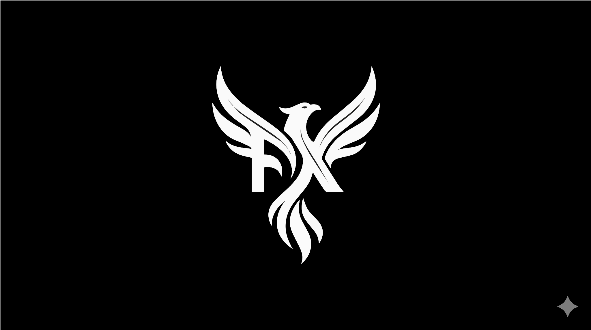

<p align="center">
  
</p>

<h1 align="center">Feynix ACC</h1>

<p align="center">
  <strong>Agent Command Center</strong><br/>
  A tmux-based TUI for managing teams of CLI agents.
</p>

<p align="center">
  <a href="https://feynixai.com">feynixai.com</a> &middot;
  <a href="https://github.com/feynixai/acc/releases"></a>
  <a href="LICENSE"></a>
</p>

---

Think VS Code's sidebar, but for terminal agents.

**Folder = tmux window. Agent = tmux pane.**

```
┌──────────┬──────────────────────────┐
│ ACC      │                          │
│          │   claude (agent pane)    │
│ ▾ myapp 2│                          │
│   ● claude├──────────────────────────┤
│   ● shell │                          │
│ ▸ docs  1│   shell (agent pane)     │
│   ○ idle  │                          │
└──────────┴──────────────────────────┘
```

## Requirements

- **tmux** 3.x+ (`brew install tmux` on macOS)
- **Rust** 1.70+ (to build from source)
- macOS or Linux

## Install

```bash
git clone https://github.com/feynixai/acc.git
cd acc
cargo build --release
cp target/release/acc ~/.local/bin/   # or /usr/local/bin/
```

Verify:

```bash
acc --help
```

## Quick Start

```bash
# Launch in any project directory
cd ~/my-project
acc

# Inside the TUI:
#   f     → add a folder (workspace)
#   a     → add an agent (e.g. "claude")
#   Enter → focus the selected agent's pane

# From any terminal:
acc list              # See all agents
acc read claude       # Read agent output
acc send claude "hi"  # Send text to an agent
acc root              # Launch root commander
```

## CLI

| Command | Description |
|---------|-------------|
| `acc` | Launch (or toggle sidebar inside tmux) |
| `acc kill` | Close the sidebar |
| `acc list` | List all running agents with status |
| `acc read <agent>` | Read agent's terminal output |
| `acc send <agent> <text>` | Send a prompt to an agent |
| `acc root` | Start root commander |

## Key Bindings

### Navigation

| Key | Action |
|-----|--------|
| `j` / `↓` | Move down |
| `k` / `↑` | Move up |
| `g` / `G` | Jump to top / bottom |
| `Enter` | Focus selected |
| `[` / `]` | Previous / next folder |
| `n` / `p` | Next / previous pane |

### Agent Management

| Key | Action |
|-----|--------|
| `f` | Add folder |
| `a` | Add agent |
| `h` / `v` | Split horizontal / vertical |
| `d` | Close pane |
| `s` | Stop agent |
| `r` | Restart agent |
| `x` | Delete (with confirmation) |
| `u` | Undo last delete |

### Command Mode

| Key | Action |
|-----|--------|
| `:` | Command mode |
| `/` | Search |
| `>` | Send text to focused agent |

| Command | Action |
|---------|--------|
| `:q` | Quit |
| `:w <name>` | Jump to window |
| `:p <name>` | Jump to pane |
| `:send <text>` | Send to focused agent |
| `:rename <name>` | Rename selected |

### tmux Shortcuts (no prefix)

| Key | Action |
|-----|--------|
| `⌥Space` | Prefix |
| `⌥z` / `⌥Z` | Next / previous window |
| `⌥a` / `⌥A` | Next / previous pane |
| `⌥1`–`⌥9` | Jump to pane by number |
| `⌥q` | Display pane numbers |
| `⌥s` | Toggle sidebar |

## Root Commander

```bash
acc root    # Opens a root window with an orchestrator agent
```

The root agent can discover, read, and delegate to other agents via `acc list`, `acc read`, and `acc send`.

## Architecture

```
src/
├── main.rs      # Entry point, CLI routing
├── app.rs       # App state, tree model
├── cli.rs       # Subcommands (list, read, send, root)
├── event.rs     # Event loop
├── handler.rs   # Input handling, sync, splits
├── command.rs   # Command mode, search, send
├── ui.rs        # Rendering (ratatui)
├── state.rs     # Persistent state (JSON)
└── tmux.rs      # tmux interactions, pane sync
```

- **Minimal state** — only folder paths persisted; agents rebuilt from live tmux panes every tick
- **Sidebar is a pane** — 20% width, moves between windows via `join-pane`
- **No duplication** — agent lists rebuilt from scratch each tick

## License

MIT &copy; 2026 [FeynixAI](https://feynixai.com)
